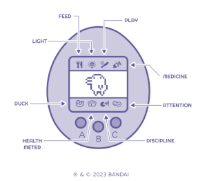

# Background
Tamagotchi is a virtual pet simulation game popular during the 90s.

Tamagotchis are a small alien species that deposited an egg on Earth to see what life was like, and it is up to the player to raise the egg into an adult creature.
The creature goes through several stages of growth, and will develop differently depending on the care the player provides, with better care resulting in an adult creature that is smarter, happier, and requires less attention.

The original Tamagotchi has the following functionalities:
- **Feed:** You can select either Meal or Snack. Make sure not to overfeed your character or they will refuse to eat.
- **Light:** Turn the light off when the character is asleep or it might get restless. The light will automatically come on once awake.
- **Duck:** When it goes to the bathroom, select the Duck icon to flush the screen.
- **Health Meter:** Shows character’s age/weight, discipline, hunger, and happiness.
- **Play:** Select the bat and ball icon to begin the game. The more times you guess correctly each game, the happier your character will be.
- **Medicine:** If you see a ‘skull’ image on your screen, it means the character is sick and needs medicine. It may take more than one dose to fully get it back to full health.
- **Attention:** If it beeps and the “Attention” icon is highlighted, check the Health Meter to see what they need. If they don’t need anything, you must discipline the character.
- **Discipline:** Use it if it beeps when happy, won’t eat when hungry, or won’t play games when unhappy. Not discipling it can result in bad manners.

# What is Tamapy
This repo holds the python code for my take on a virtual pet based on Tamagotchi, but simpler.

This is a "play around with python" personal project, do not expect super advanced options.

If you want to play with a real Tamagotchi you can buy one, since they survived through the 90s to our days and are still available for purchase!

