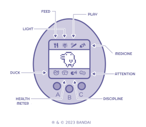

# 🐣 Tamapy: a Python3 Tamagotchi.

A simple tick‑based Tamagotchi you can play in the terminal.

Based on the original one (see picture below) but simpler.




## Features

- Stats range 0–6
- Hidden “poo” mechanic affects sickness and cleanliness
- Poo is **not shown** to the user and **not saved**
- Medicine now **cures sickness** by resetting poo
- Age increases only while playing (+1 pet year every 5 minutes)
- State saved in JSON
- 6‑square stat bars
- Fully interactive CLI


## How to run
```python tamagotchi.py```

If you want to start a new tamapy, just delete the tamapy_state.json file.


## System Design

### State machine definition

Tamapy is fundamentally a finite‑state machine whose state is defined by four visible stats and one hidden stat:
Visible state variables (0–6):
- happy
- full
- clean
- healthy

Hidden state variable (0–6): poo (not shown to the user, not saved)

Meta‑state variables:
- age_years (integer)
- last_age_update (timestamp)
- tick_count (integer)
- now (timestamp)
- start (timestamp)

The Tamapy is dead when:
```happy == 0 AND full == 0 AND clean == 0 AND health == 0```

This is the only absorbing state in the machine.


### State transitions

Every user action and every tick moves the Tamapy from one state to another.
User‑driven transitions, each action modifies exactly one stat:

| Action|Effect|
|---|---|
|feed|full +1|
|play|happy +1|
|clean|clean +1, poo -1|
|medicine|health +1, poo reset to 0|

All increments are capped at 6.


### Tick‑driven transitions

Every loop iteration triggers a tick, which applies:

    Age update  
    Every 5 minutes → age_years +1.

    Poo accumulation  
    Every 2 ticks → poo +1 (max 6).

    Sickness logic  
    If poo ≥ 3 → health -1.

    Rotational decay  
    One stat decreases each tick in this order: happy → full → clean → health → repeat
    Health only decays in rotation if health ≤ 2.

    Dirty penalty  
    If poo == 6 → clean -1.

This creates a slow, predictable decay cycle with a hidden sickness mechanic.


### Hidden poo mechanic
Although poo is not shown to the user and not saved, it remains a core internal driver of difficulty:

    It accumulates automatically.

    It triggers sickness.

    It dirties the Tamapy when maxed.

    Cleaning reduces it.

    Medicine resets it.

This creates a feedback loop:
    
    poo ↑ → sickness ↑ → health ↓ → medicine → poo reset → cycle repeats


### Persistence model

Only long‑term state is saved:

    name, happy, full, clean, health, tick_count, age_years, last_age_update, timestamps

Not saved:

    poo (always resets to 0 on load)

This keeps the save file simple and avoids exposing hidden mechanics.


### UI model

The UI is intentionally minimal:

    Shows age as: Age: X 🐾

    Shows four stat bars (6 squares each)

    Does not show poo

    Does not show internal sickness state

    Does not show tick count

This keeps the game readable and cute while hiding complexity.


### Game loop

The main loop follows a simple pattern:
```
load state
while alive:
    show status
    get user action
    apply action
    tick()
    save state
```
This ensures:
- Every action advances time
- Every action triggers decay
- State is always saved after each turn


### Design philosophy

The design intentionally blends:

#### Simplicity
- Only four visible stats.
- One hidden stat.
- One terminal condition.
- One tick per action.

#### Depth
- Hidden sickness mechanic.
- Rotational decay.
- Age progression.
- Medicine curing sickness.
- Cleaning reducing hidden poo.

#### Predictability
- Decay is deterministic.
- Sickness is deterministic.
- Age progression is deterministic.

#### Player Feedback
- The player sees the consequences (health dropping, clean dropping) without seeing the hidden cause (poo).
- This creates a subtle “mystery” effect similar to early Tamagotchis.


### Component architecture diagram

```
        USER INTERFACE LAYER
    
      CLI Menu
      Status Renderer
      Stat Bars
      Age Display
    
                │
                ▼
    
        GAME CONTROLLER
          (main loop)
    
       Load State
       Show Status
       Read Input
       Dispatch Actions
       Tick()
       Save State
    
                │
                ▼
    
        TAMAGOTCHI MODEL                         
      
      State Variables:                  
        • happy, full, clean, health 0–6
        • poo (hidden)                  
        • age_years                     
        • tick_count                    
        • timestamps                    
                                        
      Actions:                          
        • feed()                        
        • play()                        
        • clean_poo()                   
        • take_medicine()               
                                        
      Tick Engine:                      
        • update_age()                  
        • poo accumulation              
        • sickness logic                
        • rotational decay              
        • cleanliness penalty           
                                        
      Death Check:                      
        • is_dead()                     

                │
                ▼

        PERSISTENCE LAYER            
     
      Serialization:
        • to_dict()
        • from_dict()
              
      Storage:
        • JSON File: tamapy_state.json
            
      Rules:
        • poo NOT saved
        • poo resets on load   
    
```
